基于SpringBoot的环保网站（程序+论文）
=
- 完整代码获取地址：从戎源码网 ([https://armycodes.com/](https://armycodes.com/))
- 作者微信：19941326836  QQ：952045282 
- 承接计算机毕业设计、Java毕业设计、Python毕业设计、深度学习、机器学习
- 选题+开题报告+任务书+程序定制+安装调试+论文+答辩ppt 一条龙服务
- 所有选题地址https://github.com/nature924/allProject

一、项目介绍
---
基于Spring Boot框架实现的环保网站，系统包含两种角色：管理员、用户,系统分为前台和后台两大模块，主要功能如下。
### 前台功能：

1. 首页：展示环保网站的最新动态、重要公告等信息。
2. 濒危生物：提供濒危生物的相关信息以及保护措施。
3. 论坛：用户可以在论坛上进行环保话题的讨论和交流。
4. 环保健康：分享环保与健康相关的知识和资讯。
5. 环境保护：介绍环境保护的相关政策和行动。
6. 环境保护法：介绍环境保护相关的法律法规。
7. 公告信息：展示网站的重要公告和通知信息。
8. 个人中心：用户可以管理个人信息、收藏的内容、留言记录等。

### 后台功能：

### 用户：

1. 个人中心：管理个人信息。
2. 濒危生物管理：管理濒危生物的信息，包括添加、编辑、删除等操作。
3. 论坛管理：管理论坛的帖子和回复，包括审核、删除等操作。
4. 环保健康管理：管理健康相关的文章和资讯，包括添加、编辑、删除等操作。
5. 环境保护管理：管理环境保护的相关信息，包括添加、编辑、删除等操作。
6. 环境保护法管理：管理环境保护相关的法律法规，包括添加、编辑、删除等操作。
7. 公告信息管理：管理网站的公告信息，包括添加、编辑、删除等操作。

### 管理员：

1. 个人中心：管理个人信息。
2. 管理员管理：管理系统管理员的账号信息，包括添加、编辑、删除等操作。
3. 濒危生物管理：同用户的濒危生物管理功能。
4. 基础数据管理：管理网站的基础数据，如用户信息、角色权限等。
5. 论坛管理：同用户的论坛管理功能。
6. 环保健康管理：同用户的环保健康管理功能。
7. 环境保护管理：同用户的环境保护管理功能。
8. 环境保护留言管理：管理用户在环保留言板上的留言记录，包括审核、删除等操作。
9. 环境保护收藏管理：管理用户在环保网站上收藏的内容，包括查看、取消收藏等操作。
10. 环境保护法管理：同用户的环境保护法管理功能。
11. 公告信息管理：同用户的公告信息管理功能。
12. 用户管理：管理注册用户信息，包括查看、冻结、删除用户等操作。
13. 轮播图信息：管理网站首页轮播图的信息，包括添加、编辑、删除等操作。

二、项目技术
---
- 编程语言：Java
- 数据库：MySQL
- 项目管理工具：Maven
- 前端技术：VUE、HTML、Jquery、Bootstrap
- 后端技术：Spring、SpringMVC、MyBatis

三、运行环境
---
- 操作系统：Windows、macOS都可以
- JDK版本：JDK1.8以上都可以
- 开发工具：IDEA、Ecplise、Myecplise都可以
- 数据库: MySQL5.7以上都可以
- Tomcat：任意版本都可以
- Maven：任意版本都可以

四、运行截图
---
### 论文截图：
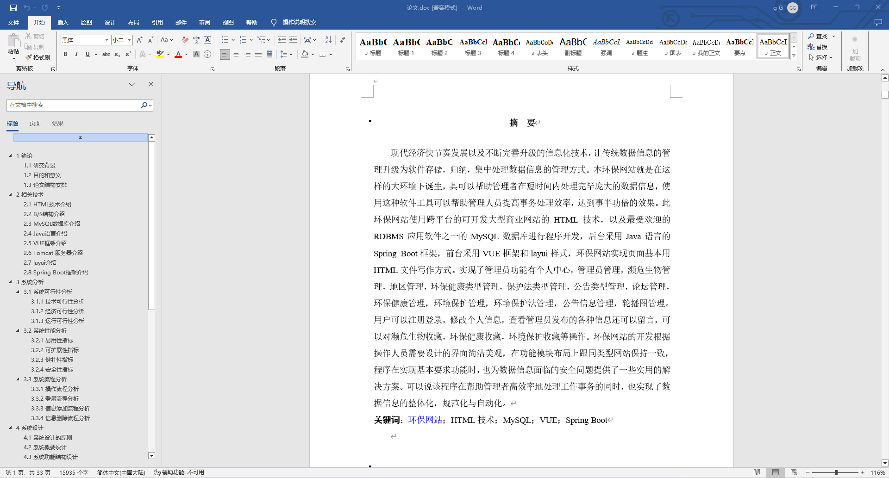
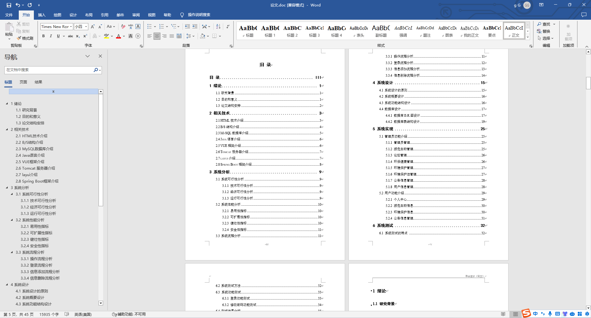

### 程序截图：
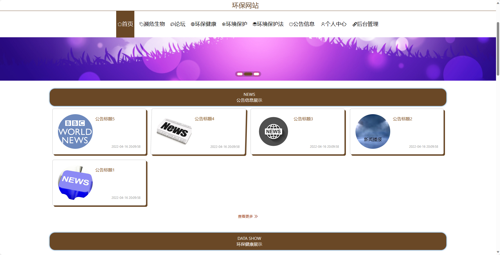
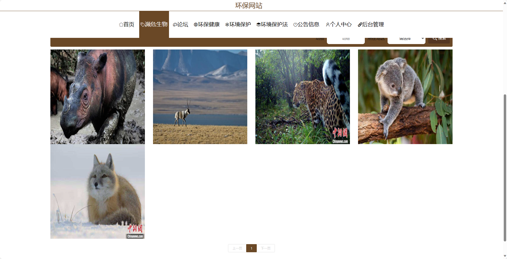
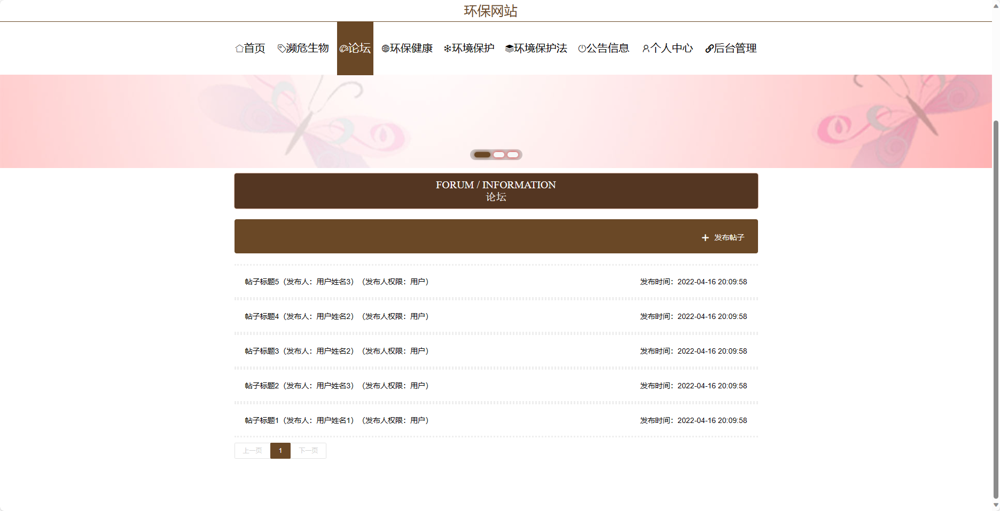
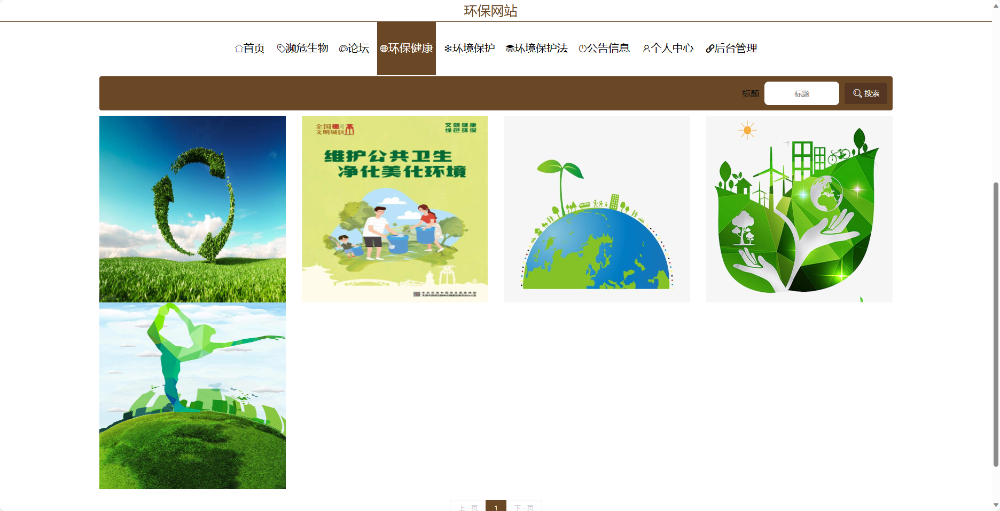
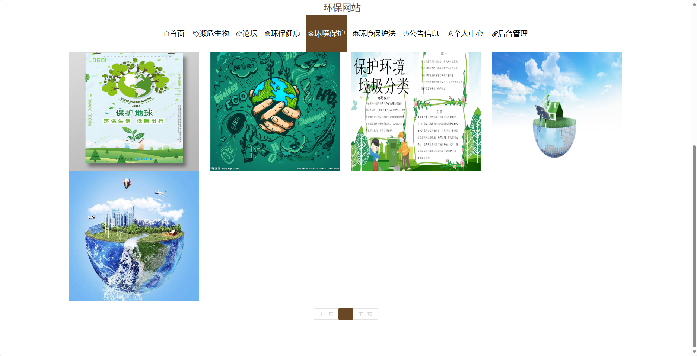
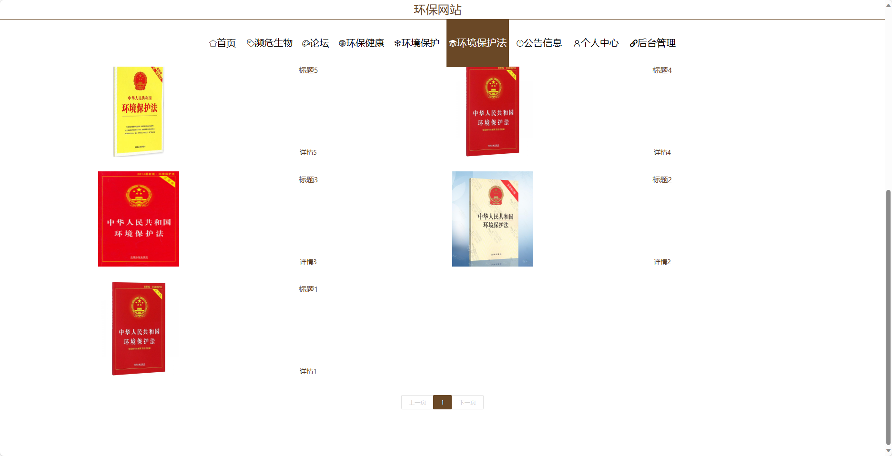
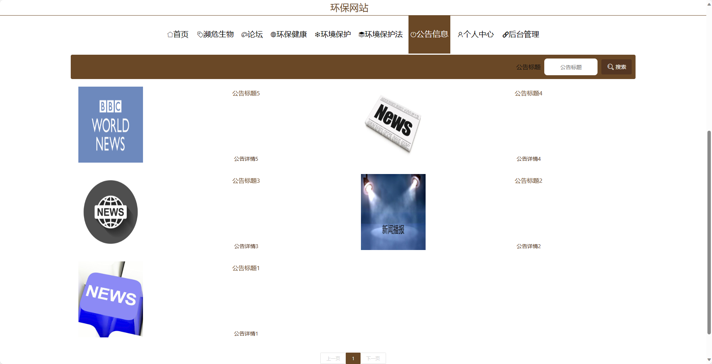
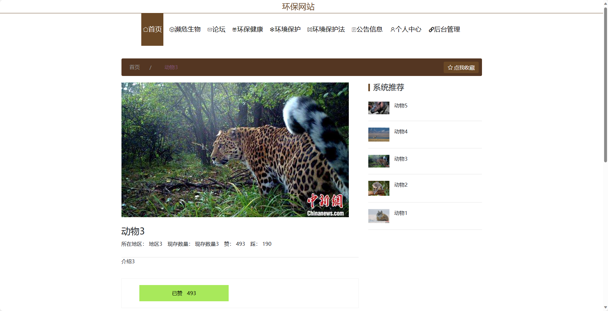
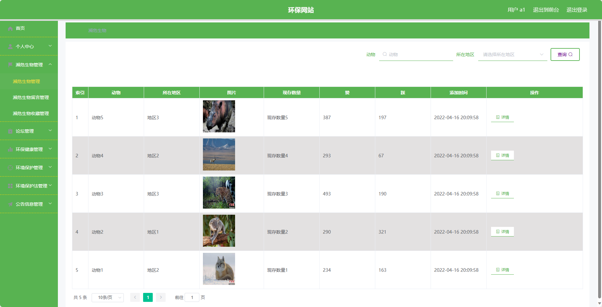
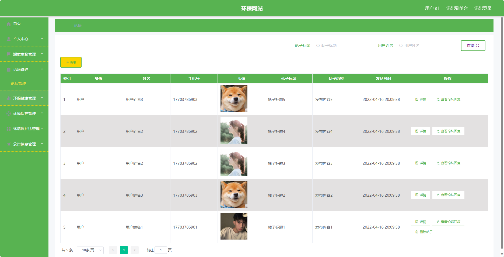

